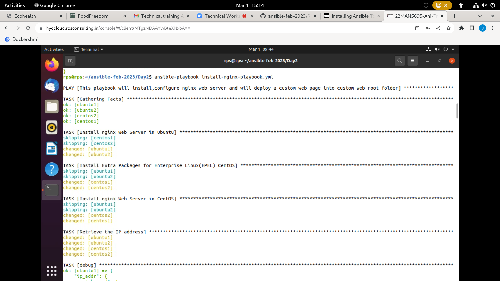
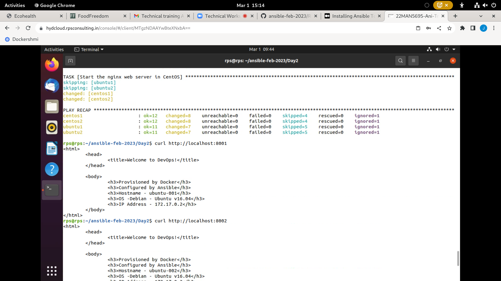

# Day 3

## ⛹️ Lab - Using List variables in Ansible playbooks
```
cd ~/ansible-feb-2023
git pull

cd Day3/loops/list
ansible-playbook playbook.yml
```

Expected output
<pre>
jegan@tektutor.org $ <b>ansible-playbook playbook.yml</b>

PLAY [This playbook will demonstrate use of list variables] ****************************************************************************

TASK [Gathering Facts] *****************************************************************************************************************
ok: [ubuntu1]
ok: [ubuntu2]

TASK [Install software tools] **********************************************************************************************************
ok: [ubuntu1] => (item=vim)
ok: [ubuntu2] => (item=vim)
ok: [ubuntu2] => (item=net-tools)
ok: [ubuntu1] => (item=net-tools)
ok: [ubuntu2] => (item=iputils-ping)
ok: [ubuntu1] => (item=iputils-ping)

PLAY RECAP *****************************************************************************************************************************
ubuntu1                    : ok=2    changed=0    unreachable=0    failed=0    skipped=0    rescued=0    ignored=0   
ubuntu2                    : ok=2    changed=0    unreachable=0    failed=0    skipped=0    rescued=0    ignored=0   
</pre>

## ⛹️ Lab - Using Dictionary variables in Ansible playbooks
```
cd ~/ansible-feb-2023
git pull

cd Day3/loops/dictionary
ansible-playbook playbook.yml
```

Expected output
<pre>
jegan@tektutor.org $ <b>ansible-playbook playbook.yml</b>

PLAY [This playbook demonstrates the use of dictionary varibles in Ansible playbook] ***************************

TASK [Gathering Facts] *****************************************************************************************
ok: [localhost]

TASK [debug] ***************************************************************************************************
ok: [localhost] => (item={'key': 'JAVA_HOME', 'value': '/var/lib/jdk8'}) => {
    "msg": "JAVA_HOME ==> /var/lib/jdk8"
}
ok: [localhost] => (item={'key': 'M2_HOME', 'value': '/usr/share/maven'}) => {
    "msg": "M2_HOME ==> /usr/share/maven"
}
ok: [localhost] => (item={'key': 'LOG_PATH', 'value': '/tmp/ansible/ansible.log'}) => {
    "msg": "LOG_PATH ==> /tmp/ansible/ansible.log"
}

PLAY RECAP *****************************************************************************************************
localhost                  : ok=2    changed=0    unreachable=0    failed=0    skipped=0    rescued=0    ignored=0   
</pre>


## ⛹️ Lab - Using sequence loop in Ansible playbook and provision docker containers

When it prompts for password, type 'rps@2345' without quotes as the admin password.
```
cd ~/ansible-feb-2023
git pull

cd Day3/loops/sequence
ansible-playbook playbook.yml --ask-become-pass
```


Expected output
<pre>
jegan@tektutor.org $ <b>ansible-playbook playbook.yml --ask-become-pass</b>
BECOME password: 

PLAY [This playbook will provision ansible node containers] ****************************************************************************

TASK [Gathering Facts] *****************************************************************************************************************
ok: [localhost]

TASK [Install Python package installer in Fedora] **************************************************************************************
ok: [localhost]

TASK [Install Python package installer in Fedora] **************************************************************************************
skipping: [localhost]

TASK [Install Docker Python SDK which is required for docker_container ansible module] *************************************************
changed: [localhost]

TASK [Delete existing ubuntu containers] ***********************************************************************************************
changed: [localhost]

TASK [Provision ubuntu ansible node containers] ****************************************************************************************
changed: [localhost] => (item=001)
changed: [localhost] => (item=002)

TASK [Provision centos ansible node containers] ****************************************************************************************
changed: [localhost] => (item=001)
changed: [localhost] => (item=002)

PLAY RECAP *****************************************************************************************************************************
localhost                  : ok=6    changed=4    unreachable=0    failed=0    skipped=1    rescued=0    ignored=0   
</pre>

## ⛹️ Lab - Building Ansible Node Docker images via Playbook
```
cd ~/ansible-feb-2023
git pull

cd Day3/build-docker-image-using-playbook
ansible-playbook playbook.yml --ask-become-pass
```

Expected output


### Provisioning containers 
```
cd Day3/loops/sequence
ansible-playbook playbook.yml --ask-become-pass
docker ps
```

### Testing if the newly provisioned containers are reachable to Ansible 
```
cd ~/ansible-feb-2003
git pull

cd Day2/ansible
ansible-playbook install-nginx-playbook.yml 

curl http://localhost:8001
curl http://localhost:8002
curl http://localhost:9001
curl http://localhost:9001
```

Expected output




## ⛹️ Lab - Ansible vault

When prompts for password, type 'root@123' without the quotes.
```
cd ~/ansible-feb-2023
git pull

cd Day3/ansible-vault
ansible-playbook playbook.yml --ask-vault-pass
```

Expected output
<pre>
jegan@tektutor.org $ <b>ansible-vault create mysql-login-credentials.yml</b>
New Vault password: 
Confirm New Vault password: 

jegan@tektutor.org $ <b>cat mysql-login-credentials.yml</b>
$ANSIBLE_VAULT;1.1;AES256
36626365373037373237653061353731323731306530616663346263653239363936393438646466
3861393233336530356231316661303937363565383138630a643232306663303439623763633936
62333466396534366331626233306661386462623531386639663138356638646531643934393465
6535386338326534330a356235353366653962623937343565393731313563633666646238353538
38336463373361633631666662356630356661653830383266633239663761393761633563613764
6331323138633365363266643062326539343662366363656532

jegan@tektutor.org $ <b>ansible-vault view mysql-login-credentials.yml</b>
Vault password: 

jegan@tektutor.org $ <b>ansible-vault edit mysql-login-credentials.yml</b>
Vault password: 

jegan@tektutor.org $ <b>cat mysql-login-credentials.yml</b>
$ANSIBLE_VAULT;1.1;AES256
38396661653339376534373862343064373164336262353632353363366464373236306661613331
3134343866633362313430316266386231326138626537350a626335616262306631333530373132
37336666613631613861323561623865346361393933353236363131373437383231616338636532
6665653535303338370a616337646235303762316539303138353634353737353962326666623635
62633664363164626637326536623763323666663163316361326434343463656465653632343636
3730633664323832666465383630363863646365383838616134

jegan@tektutor.org $ <b>ls</b>
mysql-login-credentials.yml  playbook.yml

jegan@tektutor.org $ <b>ansible-playbook playbook.yml --ask-vault-pass</b>
Vault password: 
[WARNING]: provided hosts list is empty, only localhost is available. Note that the implicit localhost does not match 'all'

PLAY [Demonstrates accessing vault protected sensitive data] ***************************************************************************

TASK [Gathering Facts] *****************************************************************************************************************
ok: [localhost]

TASK [Read vault protected data] *******************************************************************************************************
ok: [localhost] => {
    "msg": "username => root and password => admin@123"
}

PLAY RECAP *****************************************************************************************************************************
localhost                  : ok=2    changed=0    unreachable=0    failed=0    skipped=0    rescued=0    ignored=0   
</pre>

## Lab - Using Dynamic Inventory
```
cd ~/ansible-feb-2023
git pull

cd Day3/ansible-docker-dynamic-inventory/
./dynamic_inventory.py

ansible all -m ping
```

Expected output
<pre>
jegan@tektutor.org $ <b>./dynamic_inventory.py</b>
Error: No public port '22' published for ad067b4af36b
{
    "0dd095f59c19": {
        "hosts": [
            "172.17.0.10"
        ],
        "vars": {
            "ansible_become_password": "root",
            "ansible_become_user": "root",
            "ansible_host": "localhost",
            "ansible_port": "3004",
            "ansible_private_key_file": "/home/jegan/.ssh/id_rsa",
            "ansible_user": "root"
        }
    },
    "34f638e86b90": {
        "hosts": [
            "172.17.0.3"
        ],
        "vars": {
            "ansible_become_password": "root",
            "ansible_become_user": "root",
            "ansible_host": "localhost",
            "ansible_port": "2002",
            "ansible_private_key_file": "/home/jegan/.ssh/id_rsa",
            "ansible_user": "root"
        }
    },
    "3701c88f07be": {
        "hosts": [
            "172.17.0.8"
        ],
        "vars": {
            "ansible_become_password": "root",
            "ansible_become_user": "root",
            "ansible_host": "localhost",
            "ansible_port": "3002",
            "ansible_private_key_file": "/home/jegan/.ssh/id_rsa",
            "ansible_user": "root"
        }
    },
    "465d1f883e79": {
        "hosts": [
            "172.17.0.7"
        ],
        "vars": {
            "ansible_become_password": "root",
            "ansible_become_user": "root",
            "ansible_host": "localhost",
            "ansible_port": "3001",
            "ansible_private_key_file": "/home/jegan/.ssh/id_rsa",
            "ansible_user": "root"
        }
    },
    "4884753162b3": {
        "hosts": [
            "172.17.0.4"
        ],
        "vars": {
            "ansible_become_password": "root",
            "ansible_become_user": "root",
            "ansible_host": "localhost",
            "ansible_port": "2003",
            "ansible_private_key_file": "/home/jegan/.ssh/id_rsa",
            "ansible_user": "root"
        }
    },
    "4fa748ee0f32": {
        "hosts": [
            "172.17.0.5"
        ],
        "vars": {
            "ansible_become_password": "root",
            "ansible_become_user": "root",
            "ansible_host": "localhost",
            "ansible_port": "2004",
            "ansible_private_key_file": "/home/jegan/.ssh/id_rsa",
            "ansible_user": "root"
        }
    },
    "81413110c12f": {
        "hosts": [
            "172.17.0.11"
        ],
        "vars": {
            "ansible_become_password": "root",
            "ansible_become_user": "root",
            "ansible_host": "localhost",
            "ansible_port": "3005",
            "ansible_private_key_file": "/home/jegan/.ssh/id_rsa",
            "ansible_user": "root"
        }
    },
    "ad067b4af36b": {
        "hosts": [
            "172.17.0.2"
        ],
        "vars": {
            "ansible_become_password": "root",
            "ansible_become_user": "root",
            "ansible_host": "172.17.0.2",
            "ansible_port": "22",
            "ansible_private_key_file": "/home/jegan/.ssh/id_rsa",
            "ansible_user": "root"
        }
    },
    "fe5dc08fe98a": {
        "hosts": [
            "172.17.0.6"
        ],
        "vars": {
            "ansible_become_password": "root",
            "ansible_become_user": "root",
            "ansible_host": "localhost",
            "ansible_port": "2005",
            "ansible_private_key_file": "/home/jegan/.ssh/id_rsa",
            "ansible_user": "root"
        }
    }
}

jegan@tektutor.org $ <b>ansible all -m ping</b>
 [ERROR]: Error: No public port '22' published for ad067b4af36b
[WARNING]: Invalid characters were found in group names but not replaced, use -vvvv to see details
172.17.0.4 | SUCCESS => {
    "ansible_facts": {
        "discovered_interpreter_python": "/usr/bin/python3"
    },
    "changed": false,
    "ping": "pong"
}
172.17.0.3 | SUCCESS => {
    "ansible_facts": {
        "discovered_interpreter_python": "/usr/bin/python3"
    },
    "changed": false,
    "ping": "pong"
}
172.17.0.7 | SUCCESS => {
    "ansible_facts": {
        "discovered_interpreter_python": "/usr/bin/python"
    },
    "changed": false,
    "ping": "pong"
}
172.17.0.10 | SUCCESS => {
    "ansible_facts": {
        "discovered_interpreter_python": "/usr/bin/python"
    },
    "changed": false,
    "ping": "pong"
}
172.17.0.8 | SUCCESS => {
    "ansible_facts": {
        "discovered_interpreter_python": "/usr/bin/python"
    },
    "changed": false,
    "ping": "pong"
}
172.17.0.5 | SUCCESS => {
    "ansible_facts": {
        "discovered_interpreter_python": "/usr/bin/python3"
    },
    "changed": false,
    "ping": "pong"
}
172.17.0.6 | SUCCESS => {
    "ansible_facts": {
        "discovered_interpreter_python": "/usr/bin/python3"
    },
    "changed": false,
    "ping": "pong"
}
172.17.0.2 | SUCCESS => {
    "ansible_facts": {
        "discovered_interpreter_python": "/usr/bin/python3"
    },
    "changed": false,
    "ping": "pong"
}
172.17.0.11 | SUCCESS => {
    "ansible_facts": {
        "discovered_interpreter_python": "/usr/bin/python"
    },
    "changed": false,
    "ping": "pong"
}
</pre>
