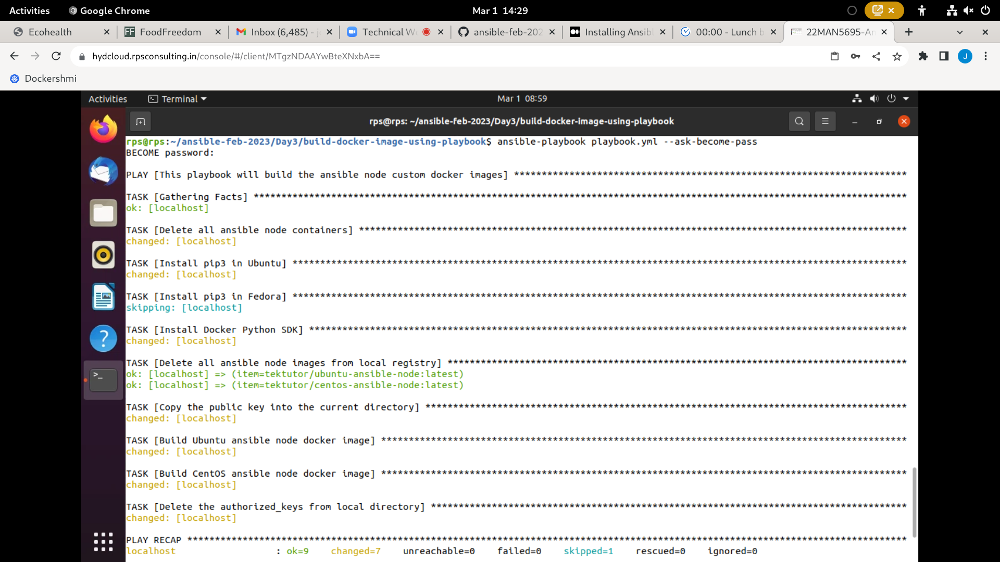

# Day 3

## ⛹️ Lab - Using List variables in Ansible playbooks
```
cd ~/ansible-feb-2023
git pull

cd Day3/loops/list
ansible-playbook playbook.yml
```

Expected output
<pre>
jegan@tektutor.org $ <b>ansible-playbook playbook.yml</b>

PLAY [This playbook will demonstrate use of list variables] ****************************************************************************

TASK [Gathering Facts] *****************************************************************************************************************
ok: [ubuntu1]
ok: [ubuntu2]

TASK [Install software tools] **********************************************************************************************************
ok: [ubuntu1] => (item=vim)
ok: [ubuntu2] => (item=vim)
ok: [ubuntu2] => (item=net-tools)
ok: [ubuntu1] => (item=net-tools)
ok: [ubuntu2] => (item=iputils-ping)
ok: [ubuntu1] => (item=iputils-ping)

PLAY RECAP *****************************************************************************************************************************
ubuntu1                    : ok=2    changed=0    unreachable=0    failed=0    skipped=0    rescued=0    ignored=0   
ubuntu2                    : ok=2    changed=0    unreachable=0    failed=0    skipped=0    rescued=0    ignored=0   
</pre>

## ⛹️ Lab - Using Dictionary variables in Ansible playbooks
```
cd ~/ansible-feb-2023
git pull

cd Day3/loops/dictionary
ansible-playbook playbook.yml
```

Expected output
<pre>
jegan@tektutor.org $ <b>ansible-playbook playbook.yml</b>

PLAY [This playbook demonstrates the use of dictionary varibles in Ansible playbook] ***************************

TASK [Gathering Facts] *****************************************************************************************
ok: [localhost]

TASK [debug] ***************************************************************************************************
ok: [localhost] => (item={'key': 'JAVA_HOME', 'value': '/var/lib/jdk8'}) => {
    "msg": "JAVA_HOME ==> /var/lib/jdk8"
}
ok: [localhost] => (item={'key': 'M2_HOME', 'value': '/usr/share/maven'}) => {
    "msg": "M2_HOME ==> /usr/share/maven"
}
ok: [localhost] => (item={'key': 'LOG_PATH', 'value': '/tmp/ansible/ansible.log'}) => {
    "msg": "LOG_PATH ==> /tmp/ansible/ansible.log"
}

PLAY RECAP *****************************************************************************************************
localhost                  : ok=2    changed=0    unreachable=0    failed=0    skipped=0    rescued=0    ignored=0   
</pre>


## ⛹️ Lab - Using sequence loop in Ansible playbook and provision docker containers

When it prompts for password, type 'rps@2345' without quotes as the admin password.
```
cd ~/ansible-feb-2023
git pull

cd Day3/loops/sequence
ansible-playbook playbook.yml --ask-become-pass
```


Expected output
<pre>
jegan@tektutor.org $ <b>ansible-playbook playbook.yml --ask-become-pass</b>
BECOME password: 

PLAY [This playbook will provision ansible node containers] ****************************************************************************

TASK [Gathering Facts] *****************************************************************************************************************
ok: [localhost]

TASK [Install Python package installer in Fedora] **************************************************************************************
ok: [localhost]

TASK [Install Python package installer in Fedora] **************************************************************************************
skipping: [localhost]

TASK [Install Docker Python SDK which is required for docker_container ansible module] *************************************************
changed: [localhost]

TASK [Delete existing ubuntu containers] ***********************************************************************************************
changed: [localhost]

TASK [Provision ubuntu ansible node containers] ****************************************************************************************
changed: [localhost] => (item=001)
changed: [localhost] => (item=002)

TASK [Provision centos ansible node containers] ****************************************************************************************
changed: [localhost] => (item=001)
changed: [localhost] => (item=002)

PLAY RECAP *****************************************************************************************************************************
localhost                  : ok=6    changed=4    unreachable=0    failed=0    skipped=1    rescued=0    ignored=0   
</pre>

## ⛹️ Lab - Building Ansible Node Docker images via Playbook
```
cd ~/ansible-feb-2023
git pull

cd Day3/build-docker-image-using-playbook
ansible-playbook playbook.yml --ask-become-pass
```

Expected output



### Provisioning containers 
```
cd Day3/loops/sequence
ansible-playbook playbook.yml --ask-become-pass
docker ps
```

### Testing if the newly provisioned containers are reachable to Ansible 
```
cd ~/ansible-feb-2003
git pull

cd Day2/ansible
ansible-playbook install-nginx-playbook.yml 

curl http://localhost:8001
curl http://localhost:8002
curl http://localhost:9001
curl http://localhost:9001

```
