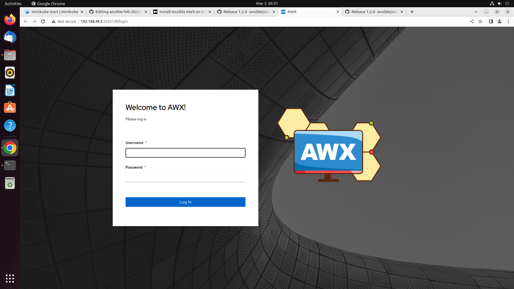
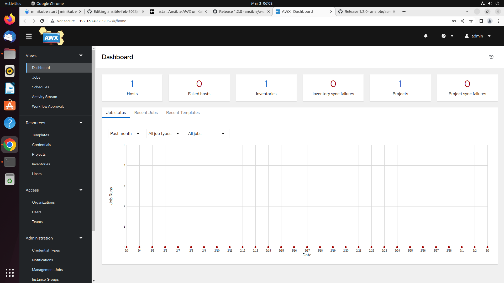

# Day 4

## ⛹️‍♂️ Lab - Writing a custom Ansible module and invoking it from a playbook
```
cd ~/ansible-feb-2023
git pull

cd Day4/custom-ansible-module
ansible-playbook playbook.yml
```

Expected output
<pre>
jegan@tektutor.org:~/ansible-feb-2023/Day4/custom-ansible-module$ <b>tree</b>
.
├── library
│   └── hello.py
└── playbook.yml

1 directory, 2 files
jegan@tektutor.org:~/ansible-feb-2023/Day4/custom-ansible-module$ <b>ansible-playbook playbook.yml</b>
[WARNING]: No inventory was parsed, only implicit localhost is available
[WARNING]: provided hosts list is empty, only localhost is available. Note that the implicit localhost does not match
'all'

PLAY [Demonstrates invoking our Custom Ansible module] *******************************************************************

TASK [Gathering Facts] ***************************************************************************************************
ok: [localhost]

TASK [Invoke custom hello module] ****************************************************************************************
changed: [localhost]

TASK [debug] *************************************************************************************************************
ok: [localhost] => {
    "output": {
        "changed": true,
        "failed": false,
        "output": "Hello Custom Ansible Module!"
    }
}

PLAY RECAP ***************************************************************************************************************
localhost                  : ok=3    changed=1    unreachable=0    failed=0    skipped=0    rescued=0    ignored=0   
</pre>

### 🧯 For Troubleshooting/debug 

For debugging Playbook/modules,  you could configure Ansible not to clean up the tmp folder where it copies the module while running then on the remote nodes. You need to do this on your Ansible Controller Machine
```
export ANSIBLE_KEEP_REMOTE_FILES=1
```

On you ACM, you may then redirect the ansible-playbook log as shown below
```
cd ~/ansible-feb-2023
git pull

cd Day4/custom-ansible-module
docker ps
ansible-playbook playbook.yml --limit=0d2fc10bc144 -vvvv > build.yml 2>&1 
```

Now you may get inside the container with id 0d2fc10bc144 to debug the issue
```
docker exec -it 0d2fc10bc144 bash
cd ~/.ansible/tmp
```

Expected output
<pre>
jegan@tektutor.org:~/ansible-feb-2023/Day4/custom-ansible-module$ <b>docker exec -it 0d2fc10bc144 bash</b>
[root@centos-004 /]# <b>cd ~/.ansible</b>
[root@centos-004 .ansible]# <b>ls</b>
tmp
[root@centos-004 .ansible]# <b>cd tmp/</b>
[root@centos-004 tmp]# ls
ansible-tmp-1677733651.3489008-168749-182389230769079
ansible-tmp-1677733655.1155908-169632-168165463706299
ansible-tmp-1677733868.388136-175533-55863311289092
ansible-tmp-1677733872.07534-176621-70400668909436
ansible-tmp-1677734028.9809787-181379-262010316473861
ansible-tmp-1677734033.6801047-182385-233611713544228
ansible-tmp-1677734259.992747-190969-180520090745503
ansible-tmp-1677734261.9004803-191110-41648958009871
ansible-tmp-1677734460.0694542-195769-172741943065518
ansible-tmp-1677734461.9884684-195904-123749205954909
[root@centos-004 tmp]# cd ansible-tmp-1677734461.9884684-195904-123749205954909
[root@centos-004 ansible-tmp-1677734461.9884684-195904-123749205954909]# <b>ls</b>
[root@centos-004 ansible-tmp-1677734461.9884684-195904-123749205954909]# <b>ls</b>
AnsiballZ_hello.py

[root@centos-004 ansible-tmp-1677734461.9884684-195904-123749205954909]# <b>python AnsiballZ_hello.py</b>
Traceback (most recent call last):
  File "AnsiballZ_hello.py", line 259, in <module>
    _ansiballz_main()
  File "AnsiballZ_hello.py", line 249, in _ansiballz_main
    invoke_module(zipped_mod, temp_path, ANSIBALLZ_PARAMS)
  File "AnsiballZ_hello.py", line 123, in invoke_module
    run_name='__main__', alter_sys=True)
  File "/usr/lib64/python2.7/runpy.py", line 170, in run_module
    mod_name, loader, code, fname = _get_module_details(mod_name)
  File "/usr/lib64/python2.7/runpy.py", line 113, in _get_module_details
    code = loader.get_code(mod_name)
  File "/tmp/ansible_hello_payload_RQsu80/ansible_hello_payload.zip/ansible/modules/hello.py", line 21
    module.exit_json(**result,changed=True)
                             ^
SyntaxError: invalid syntax
</pre>

## Assignment - Develop a custom Ansible Module 

Implement a custom ansible module in a file named add.py. It will accept two float numbers and returns the result as the reponse.

## Install Ansible Tower opensource
```
curl -LO https://storage.googleapis.com/minikube/releases/latest/minikube-linux-amd64
sudo install minikube-linux-amd64 /usr/local/bin/minikube
minikube delete
minikube start --addons=ingress --cpus=4 --cni=flannel --install-addons=true --kubernetes-version=stable --memory=8g
minikube status

curl -LO "https://dl.k8s.io/release/$(curl -L -s https://dl.k8s.io/release/stable.txt)/bin/linux/amd64/kubectl"
chmod +x ./kubectl
sudo mv ./kubectl /usr/local/bin
kubectl cluster-info
kubectl get nodes
```

Delete the existing awx-operator as it is very old
```
kubectl delete -f https://raw.githubusercontent.com/ansible/awx-operator/0.12.0/deploy/awx-operator.yaml
kubectl delete -f awx.yml
```

Install HELM Kubernets Package Manager 
```
curl -fsSL -o get_helm.sh https://raw.githubusercontent.com/helm/helm/main/scripts/get-helm-3
chmod 700 get_helm.sh
./get_helm.sh
```

Expected output
<pre>
jegan@tektutor.org:~/Downloads$ <b>curl -fsSL -o get_helm.sh https://raw.githubusercontent.com/helm/helm/main/scripts/get-helm-3</b>
jegan@tektutor.org:~/Downloads$ <b>chmod 700 get_helm.sh</b>
jegan@tektutor.org:~/Downloads$ <b>./get_helm.sh</b>
</pre>


Deploy the latest version of AWX Operator
```
wget https://github.com/ansible/awx-operator/releases/download/1.2.0/awx-operator-1.2.0.tgz
helm install awx awx-operator-1.2.0.tgz
helm list
```
Expected output
<pre>
jegan@tektutor.org:~/Downloads$ <b>helm install awx awx-operator-1.2.0.tgz</b>
NAME: awx
LAST DEPLOYED: Fri Mar  3 05:25:15 2023
NAMESPACE: default
STATUS: deployed
REVISION: 1
TEST SUITE: None
NOTES:
AWX Operator installed with Helm Chart version 1.2.0

jegan@tektutor.org:~/Downloads$ <b>helm list</b>
NAME	NAMESPACE	REVISION	UPDATED                                	STATUS  	CHART             	APP VERSION
awx 	default  	1       	2023-03-03 05:25:15.489203383 +0530 IST	deployed	awx-operator-1.2.0	1.2.0      
</pre>


Create an awx.yml with below content
```
---
apiVersion: awx.ansible.com/v1beta1
kind: AWX
metadata:
  name: awx-demo
spec:
  service_type: nodeport
```

Run the below command
```
kubectl apply -f awx.yml
```

Expected output
<pre>
jegan@tektutor.org:~/Downloads$ <b>kubectl get po</b>
NAME                                              READY   STATUS    RESTARTS   AGE
awx-demo-9466b76d5-n28st                          4/4     Running   0          4m52s
awx-demo-postgres-13-0                            1/1     Running   0          5m29s
awx-operator-controller-manager-ddfcd98fd-h8r9b   2/2     Running   0          8m4s

jegan@tektutor.org:~/Downloads$ <b>kubectl get svc</b>
NAME                                              TYPE        CLUSTER-IP      EXTERNAL-IP   PORT(S)        AGE
awx-demo-postgres-13                              ClusterIP   None            <none>        5432/TCP       5m43s
awx-demo-service                                  NodePort    10.101.99.132   <none>        80:32057/TCP   5m8s
awx-operator-controller-manager-metrics-service   ClusterIP   10.96.126.114   <none>        8443/TCP       8m18s
kubernetes                                        ClusterIP   10.96.0.1       <none>        443/TCP        45m

jegan@tektutor.org:~/Downloads$ <b>kubectl describe svc awx-demo-service</b>
Name:                     awx-demo-service
Namespace:                default
Labels:                   app.kubernetes.io/component=awx
                          app.kubernetes.io/managed-by=awx-operator
                          app.kubernetes.io/name=awx-demo
                          app.kubernetes.io/operator-version=1.2.0
                          app.kubernetes.io/part-of=awx-demo
Annotations:              <none>
Selector:                 app.kubernetes.io/component=awx,app.kubernetes.io/managed-by=awx-operator,app.kubernetes.io/name=awx-demo
Type:                     NodePort
IP Family Policy:         SingleStack
IP Families:              IPv4
IP:                       10.101.99.132
IPs:                      10.101.99.132
Port:                     http  80/TCP
TargetPort:               8052/TCP
NodePort:                 http  32057/TCP
Endpoints:                10.244.0.16:8052
Session Affinity:         None
External Traffic Policy:  Cluster
Events:                   <none>

jegan@tektutor.org:~/Downloads$ minikube service awx-demo-service
|-----------|------------------|-------------|---------------------------|
| NAMESPACE |       NAME       | TARGET PORT |            URL            |
|-----------|------------------|-------------|---------------------------|
| default   | awx-demo-service | http/80     | http://192.168.49.2:32057 |
|-----------|------------------|-------------|---------------------------|
🎉  Opening service default/awx-demo-service in default browser...
</pre>

If everything went well, you will get the below page in your default web browser on the lab machine


Finding the AWX Ansible Tower password
```
kubectl get secret awx-demo-admin-password -o jsonpath="{.data.password}" | base64 --decode
```
Expected output
<pre>
jegan@tektutor.org:~/Downloads$ <b>kubectl get secret awx-demo-admin-password -o jsonpath="{.data.password}" | base64 --decode</b>
NoQvhzzNTB1pcF97rQt3wBmR16XH4m26
</pre>

AWX Login Credentials
```
username - admin
password - NoQvhzzNTB1pcF97rQt3wBmR16XH4m26
```

Expected output

